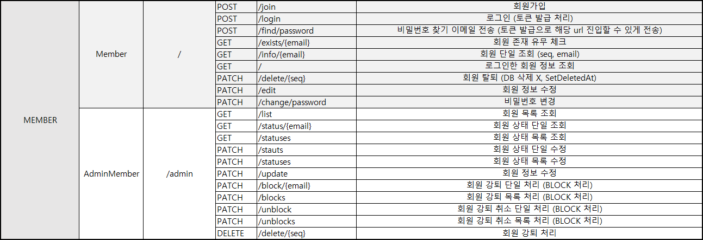
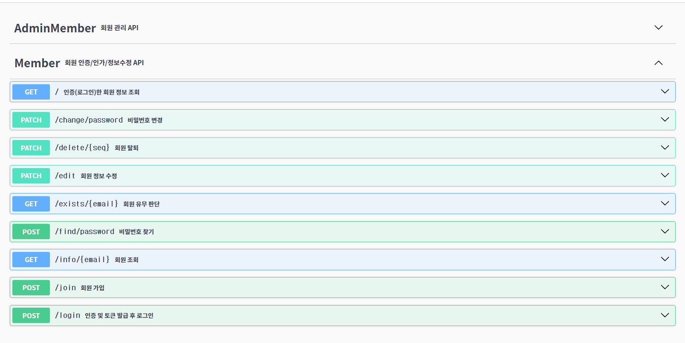
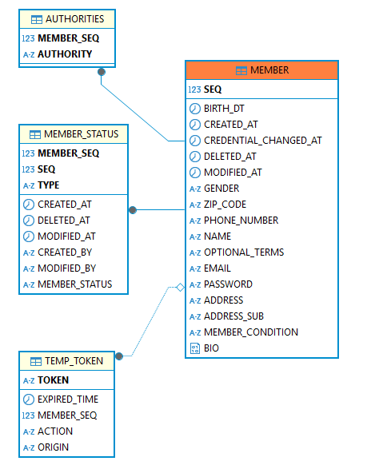

  

# AnonymousCIS 프로젝트

# 기능 명세서

## 🔹 도메인 URL 설계 🔹

## 🔹 관리자 페이지 🔹
- 회원 목록 조회
- 회원 상태 단일 조회
- 회원 상태 목록 조회
- 회원 상태 단일 수정
- 회원 상태 목록 수정
- 회원 정보 수정
- 회원 강퇴 단일 처리 (BLOCK 처리)
- 회원 강퇴 목록 처리 (BLOCK 처리)
- 회원 강퇴 취소 단일 처리 (BLOCK 처리)
- 회원 강퇴 취소 목록 처리 (BLOCK 처리)
- 회원 강퇴 처리

## 🔹 사용자(회원) 페이지 🔹
-  회원가입
-  로그인 (토큰 발급 처리)
-  비밀번호 찾기 이메일 전송 (토큰 발급으로 해당 url 진입할 수 있게 전송)
-  회원 존재 유무 체크
-  회원 단일 조회 (seq, email)
-  로그인한 회원 정보 조회
-  회원 탈퇴 (DB 삭제 X, SetDeletedAt)
-  회원 정보 수정
-  비밀번호 변경

## 🔹 Swagger API 🔹
- 링크 : https://cis-member-service.koreait.xyz/apidocs.html

  

# ERD 작성 (엔티티 관계도)

# MEMBER
| 키  | 논리              | 물리                    | 도메인             | 타입       | Length | UNIQUE | NULL허용 | 기본값     |
|:--:|-----------------|-----------------------|-----------------|----------|--------|--------|--------|---------|
| pk | 회원 번호           | SEQ                   | Long            | NUMBER   |        |        |        |         |
|    | 이름              | NAME                  | String          | VARCHAR  | 40     |        | N      |         |       |
|    | 이메일 (로그인 ID)    | EMAIL                 | String          | VARCHAR  | 65     | Y      | N      |         |  |
|    | 비밀번호            | PASSWORD              | String          | VARCHAR  | 65     |        | N      |         |       |
|    | 우편번호            | ZIP_CODE              | String          | VARCHAR  | 10     |        | N      |         |       |
|    | 주소              | ADDRESS               | String          | VARCHAR  | 100    |        | N      |         |
|    | 상세 주소           | ADDRESS_SUB           | String          | VARCHAR  | 100    |        | Y      |         |       |
|    | 전화번호            | PHONE_NUMBER          | String          | VARCHAR  | 20     |        | N      |         |       |
|    | 선택 약관           | OPTIONAL_TERMS        | String          | VARCHAR  | 50     |        | Y      |         |       |
|    | 성별              | GENDER                | Gender          | ENUM     | 10     |        | N      |         |       |
|    | 생년월일            | BIRTH_DT              | LocalDate       | DATE     |        |        | N      |         |       |
|    | 회원 상태           | MEMBER_CONDITION      | MemberCondition | ENUM     | 20     |        | Y      |         |       |
|    | 권한              | AUTHORITIES           | Authorities     | ENTITY   |        |        | Y      |         |       |
|    | 비밀번호 변경 일시      | CREDENTIAL_CHANGED_AT | LocalDateTime   | DATETIME |        |        | Y      |         |       |
|    | 가입일시            | CREATEDAT             | LocalDateTime   | DATE     |        |        |        | SYSDATE |
|    | 수정일시            | MODIFIEDAT            | LocalDateTime   | DATE     |        |        |        | SYSDATE |
|    | 탈퇴일시            | DELETEDAT             | LocalDateTime   | DATE     |        |        |        | SYSDATE |

# Authorities
| 키  | 논리 | 물리        | 도메인       | 타입     | Length | UNIQUE | NULL허용 | 기본값 |
|:--:|----|-----------|-----------|--------|--------|--------|--------|-----|
| pk | 회원 | MEMBER    | Member    | ENTITY |        |        | N      |     |
|    | 권한 | AUTHORITY | Authority | ENUM   | 15     |        | N      |     |       |

# MemberStatus

| 키  | 논리   | 물리            | 도메인           | 타입      | Length | UNIQUE | NULL허용 | 기본값     |
|:--:|------|---------------|---------------|---------|--------|--------|--------|---------|
| pk | 회원   | MEMBER        | Member        | ENTITY  |        |        | N      |         |
| pk | 타입   | TYPE          | String        | VARCHAR | 40     |        | N      |         |       |
| pk | 번호   | SEQ           | Long          | NUMBER  | 65     | Y      | N      |         |  |
|    | 상태   | MEMBER_STATUS | DomainStatus  | ENUM    | 65     |        | N      |         |       |
|    | 생성일시 | CREATEDAT     | LocalDateTime | DATE    |        |        |        | SYSDATE |
|    | 수정일시 | MODIFIEDAT    | LocalDateTime | DATE    |        |        |        | SYSDATE |
|    | 삭제일시 | DELETEDAT     | LocalDateTime | DATE    |        |        |        | SYSDATE |

# MemberStatus

| 키  | 논리    | 물리           | 도메인           | 타입       | Length | UNIQUE | NULL허용 | 기본값 |
|:--:|-------|--------------|---------------|----------|--------|--------|--------|-----|
| pk | 토큰    | TOKEN        | String        | VARCHAR  | 45     |        | N      |     |
|    | 타입    | ACTION       | TokenAction   | ENUM     | 20     |        | N      |     |       |
|    | 회원    | MEMBER       | Member        | ENTITY   |        |        | N      |     |  |
|    | 만료 시간 | EXPIRED_TIME | LocalDateTime | DATETIME |        |        | Y      |     |  |
|    | 원주소   | ORIGIN       | String        | VARCHAR  | 65     |        | N      |     |       |